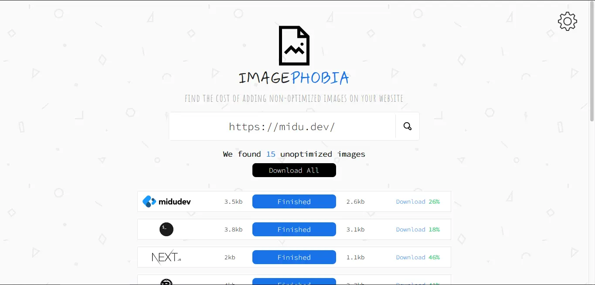
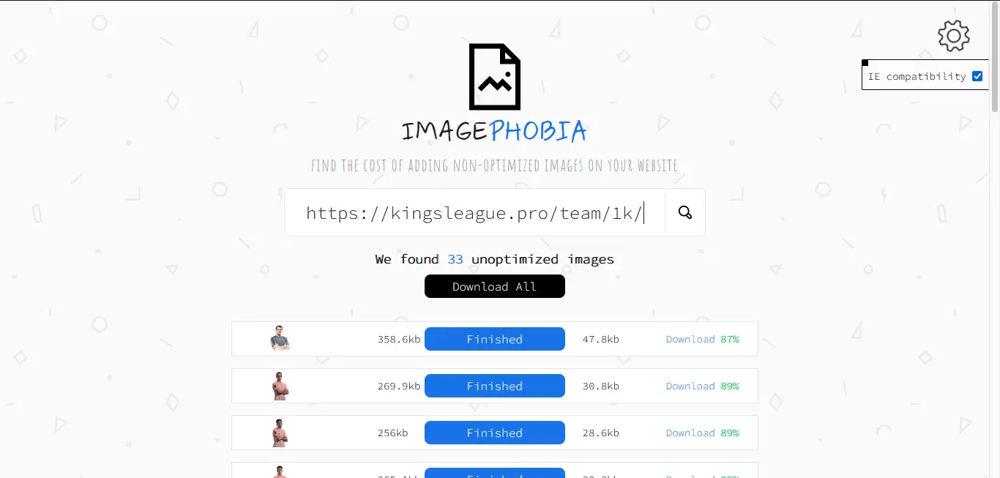

# IMAGEPHOBIA

## Introducción

¿Tú página carga lenta? ¿Ya chequeaste el peso de las imágenes que usas?

Es muy posible que tengas más de una imagen no optimizada que genere un mal rendimiento para tu sitio web.

**IMAGEPHOBIA** es una aplicación simple y minimalista en la que colocaras la URL de un sitio web, y automáticamente optimizara todas las imágenes sin perder _calidad visual_ y siéndole indiferente el _formato_ de la imagen.

### **Busca y optimiza al maximo pagina**

### **Soporte para IE incluido, ¡Activalo!**

---

## Hackaton

**IMAGEPHOBIA** es un proyecto realizado para la [hackaton](https://cloudinary.com/blog/cloudinary-cloudcreate-tech-products-hackathon) de [Cloudinary](https://cloudinary.com/).

### Como usarlo

No logre encontrar la forma de ejecutar mi código front y back de forma gratuita. Por lo que lamentable, pero también afortunadamente, podemos probarlo desde local.

Comando: `pnpm run start` || `npm run start`

**IMPORTANTE:** Es necesarior que agregues en un .env donde coloques los siguientes datos

- CLOUDINARY_CLOUD_NAME
- CLOUDINARY_API_KEY
- CLOUDINARY_API_SECRET

Ya una vez ejecutado podremos verlo [aquí](http://localhost:3000/)

### Tecnologias usadas

- [Preact](https://preactjs.com/): Utilizo preact para maquetar todo lo que es la interfaz y llevar la logica de los estados.
- [Playwright](https://playwright.dev/): Utilizo Playwright para realizar scrapping sobre el sitio web a analizar.
- [Express](https://express.com.ar): Utilizo Express para levantar la API donde consulto utilizando playwright por detrás.
- [Cloudinary](https://cloudinary.com/): Utilizo la API de cloudinary para lo optimización de imágenes.
- [Tailwind](https://tailwindcss.com/): Utilizo tailwind para un estilado rápido y lindo.
- [Astro](https://astro.build/): Utilizo Astro como orquestador de todo.

## Agradecimientos

Esta es mi primera vez participando en una Hackaton y estoy muy agradecido con [cloudinary](https://tailwindcss.com/) por crear e incentivar a la comunidad con estos eventos.

Y como no podía faltar un agradecimiento a [Midu](https://www.twitch.tv/midudev) que es un genio por compartir un contenido de gran calidad, aunque más allá de agradecimiento son unas felicitaciones. sosincreíble Midu, tu forma de transmitir, tu forma de pensar, lo atento que eres. Simplemente eso.

**MUCHAS GRACIAS** Y **ÉXITOS** PARA TODOS LOS DEMÁS DESARROLLADORES Y DESARROLLADORAS QUE PARTICIPAN EN ESTA HACKATON Y EN ESTA HERMOSA COMUNIDAD.
